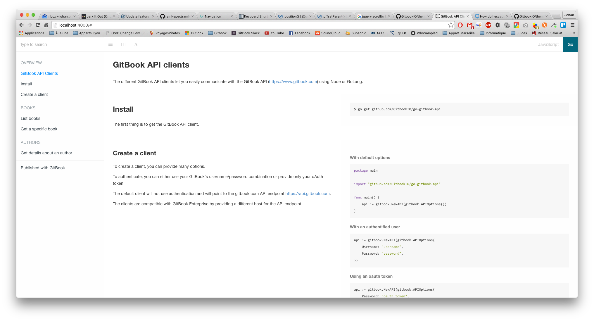
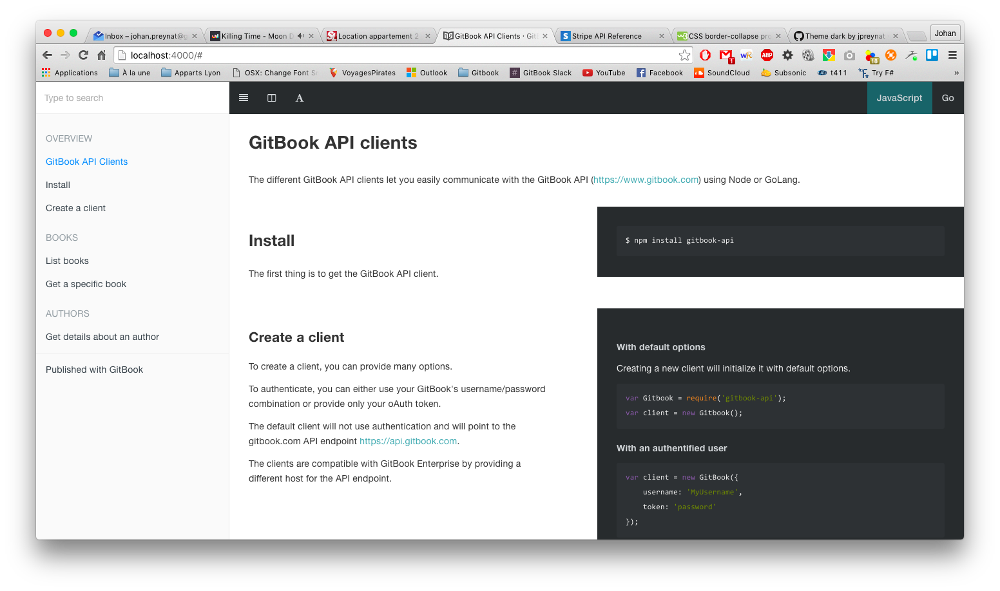
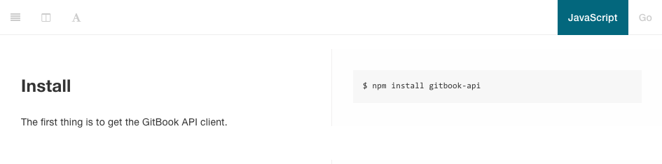
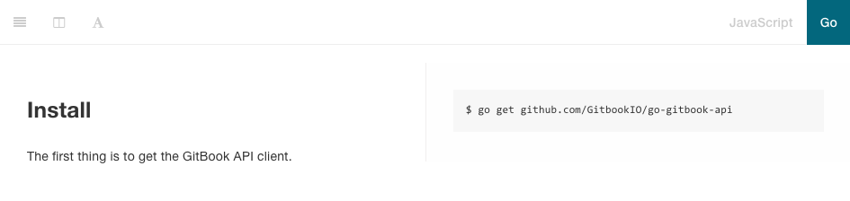
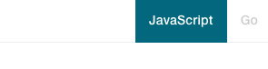
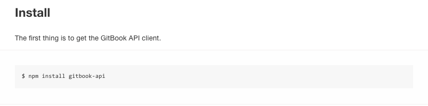
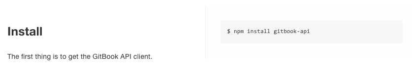

# GitBook API Theme

Theme for using GitBook to publish an API documentation.

This theme works perfectly with search plugins (like [the default plugin](https://github.com/GitbookIO/plugin-search) or [algolia](https://github.com/GitbookIO/plugin-algolia)).



It also integrates well with the default fontsettings plugin to use the Dark theme.



### Usage

This theme requires GitBook version 3 or later.

Add the theme to your book's configuration (book.json):

```json
{
    "plugins": ["theme-api"]
}
```

To use the Dark theme by default:

```json
{
    "plugins": ["theme-api"],
    "pluginsConfig": {
        "theme-api": {
            "theme": "dark"
        }
    }
}
```

### Defining methods

The theme allows to easily define methods with examples for different languages, using the templating blocks syntax.

A method block can contain any number of nested `sample` and `common` blocks.

Those nested blocks are documented below.

#### Sample blocks

While the body of the method block will be used as the definition for your method, each `sample` will be used to display examples. To do so, each `sample` block should specify a language using the `lang` arguments.

This is great for managing examples in different languages, for instance when documenting multiple API clients.

    
    ## Install {#install}

    The first thing is to get the GitBook API client.

    
    ```bash
    $ npm install gitbook-api
    ```

    
    ```bash
    $ go get github.com/GitbookIO/go-gitbook-api
    ```
    




On each page containing `method` blocks with samples, a switcher is automatically added at the top-right corner to easily select which language to display.

The name of each language can be configured in your `book.json` file, with it's `lang` property corresponding to the `sample` block `lang` argument:

```json
{
  "plugins": ["theme-api"],
  "pluginsConfig": {
    "theme-api": {
      "languages": [
        {
          "lang": "js",          // sample lang argument
          "name": "JavaScript",  // corresponding name to be displayed
          "default": true        // default language to show
        },
        {
          "lang": "go",
          "name": "Go"
        }
      ]
    }
  }
}
```



Most programming languages are supported by default, with name mapping following the [highlight.js convention](http://highlightjs.readthedocs.io/en/latest/css-classes-reference.html#language-names-and-aliases).

Note that a `sample` block can contain any markdown content to be displayed for this language, not only code blocks, as illustrated below.


#### Common blocks

Common blocks are used to display content to be displayed for all languages in your examples.

    
    ## Simple method

    
    This text will only appear for JavaScript.

    
    This text will only appear for Go.

    
    This will appear for both JavaScript and Go.
    


### Layout

The theme provides two layouts to display your examples: one-column or two-columns (split).

###### One column layout


###### Split layout


The layout can be toggled from the toolbar using the layout icon: 

The default aspect can also be set in the theme configuration in the `book.json` file:

```json
{
  "plugins": ["theme-api"],
  "pluginsConfig": {
    "theme-api": {
      "split": true
    }
  }
}
```