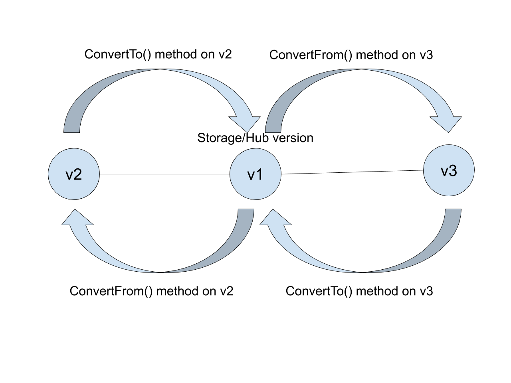

## Concepts
Let's take a quick look at some of the basic concepts related to multiple
versions in Kubernetes.

### Hub/Spoke/Storage Versions
All versions of a Kubernetes object share the same underlying storage. So if you
have versions v1, v2 and v3 of a kind, kubernetes will use one of the versions to
persist the object of that Kind in Etcd. You can specify the version to be used
for storage in the Custom Resource definition for that API.

One can think of storage version as the hub and other versions as spokes to visualize the
relationship between storage and other versions (as shown below in the diagram).
The important thing to note is that conversion between storage and other version
should be lossless (round trippable). As shown in the diagram below, v1 is the 
storage/hub version and v2 and v3 spoke version. This tutorial uses 
the terms `storage version` and `hub` interchangeably.

So if each spoke version implements conversion functions to convert
to/from a `hub`, then conversions betweek spokes can be derived. In the example
shown in the above diagram, a v2 object can be converted to v3 object by first
converting `v2` to `v1` and then converting `v2` to `v3`. And same is true for
converting `v3` object to `v2`.

### Conversion Webhook
API clients such as kubectl, controllers can request different versions of your
API. So when a client requests for a version other than the storage version of
your API, Kubernetes API server calls out to an HTTP endpoint to perform the
conversion between the requested version and storage version. This HTTP endpoint
is called Conversion Webhook and its discovery/connection parameters are
configured in the CRD definition. With kubebuilder, you just need to implement
conversion functions between different versions and it takes care of the rest of
the work associated with running a webhook server, generating and plumbing the 
conversion webhook handler.

