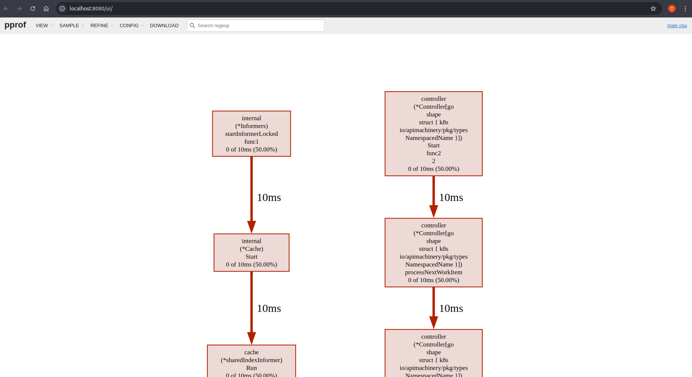

# Monitoring Performance with Pprof

[Pprof][github], a Go profiling tool, helps identify performance bottlenecks in areas like CPU and memory usage. It's integrated with the controller-runtime library's HTTP server, enabling profiling via HTTP endpoints. You can visualize the data using go tool pprof. Since [Pprof][github] is built into controller-runtime, no separate installation is needed. [Manager options][manager-options-doc] make it easy to enable pprof and gather runtime metrics to optimize controller performance.

<aside class="note warning">
<h1>Not Recommended for Production</h1>

While [Pprof][github] is an excellent tool for profiling and debugging, it is not recommended to leave it enabled in production environments. The primary reasons are:

1. **Security Risk**: The profiling endpoints expose detailed information about your application's performance and resource usage, which could be exploited if accessed by unauthorized users.
2. **Overhead**: Running profiling can introduce performance overhead, mainly CPU usage, especially under heavy load, potentially impacting production workloads.

</aside>

## How to use Pprof?

1. **Enabling Pprof**

    In your `cmd/main.go` file, add the field:

    ```golang
    mgr, err := ctrl.NewManager(ctrl.GetConfigOrDie(), ctrl.Options{
      ...
      // PprofBindAddress is the TCP address that the controller should bind to
      // for serving pprof. Specify the manager address and the port that should be bind.
      PprofBindAddress:       ":8082",
      ...
    })
    ```

2. **Test It Out**

    After enabling [Pprof][github], you need to build and deploy your controller to test it out. Follow the steps in the [Quick Start guide][quick-start-run-it] to run your project locally or on a cluster.

    Then, you can apply your CRs/samples in order to monitor the performance of its controllers.

3. **Exporting the data**

    Using `curl`, export the profiling statistics to a file like this:

    ```bash
    # Note that we are using the bind host and port configured via the
    # Manager Options in the cmd/main.go
    curl -s "http://127.0.0.1:8082/debug/pprof/profile" > ./cpu-profile.out
    ```

4. **Visualizing the results on Browser**

    ```bash
    # Go tool will open a session on port 8080.
    # You can change this as per your own need.
    go tool pprof -http=:8080 ./cpu-profile.out
    ```

    Visualizaion results will vary depending on the deployed workload, and the Controller's behavior.
    However, you'll see the result on your browser similar to this one:

    

[manager-options-doc]: https://pkg.go.dev/sigs.k8s.io/controller-runtime/pkg/manager
[quick-start-run-it]: ../quick-start.md#test-it-out
[github]: https://github.com/google/pprof